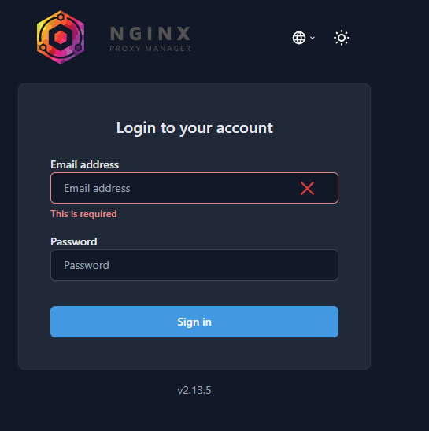
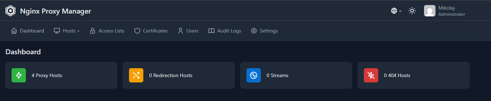
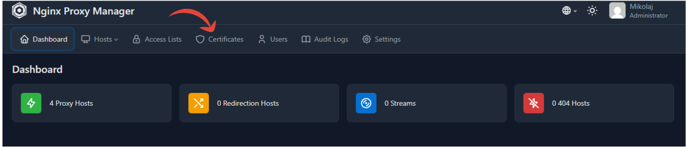
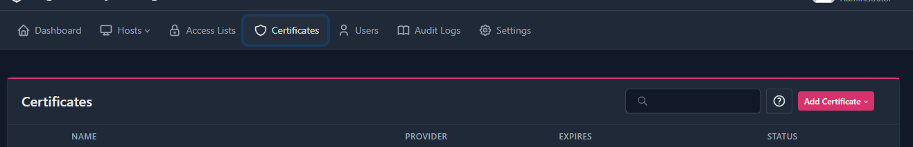
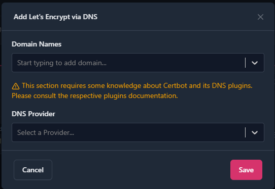
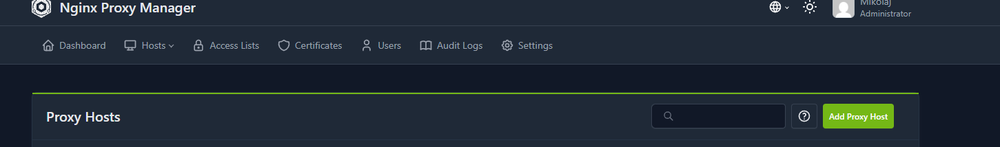
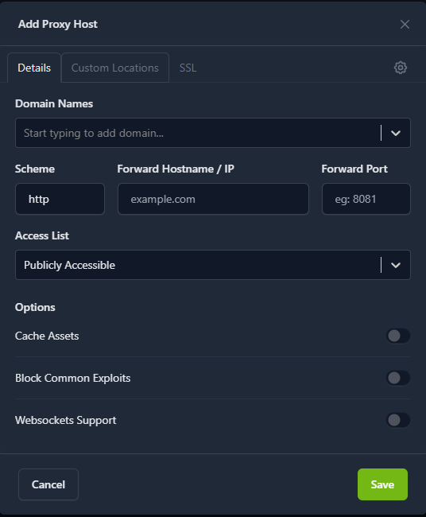
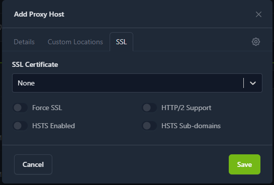

#Cześć
<b>Instalacja Ngix-proxy-manager</b><br>
Zaczynamy od odpalenia maszyny na której chcemy to zainstalować, jak już to zrobione to odpalamy terminal i tworzymy nowy folder.

Tymi o to poleceniami:
```bash
$ mkdir ngix
$ cd ngix
$ nano docker-compose.yml
```

Utwórz plik `docker-compose.yml` i wklej poniższą konfigurację:

```yaml file="docker-compose.yml"
services:
  app:
    image: 'jc21/nginx-proxy-manager:latest'
    restart: unless-stopped

    ports:
      - '80:80'   # Public HTTP Port
      - '443:443' # Public HTTPS Port
      - '81:81'   # Admin Web Port

    environment:
      TZ: "Australia/Brisbane"

    volumes:
      - ./data:/data
      - ./letsencrypt:/etc/letsencrypt
```
Następnie należy użyć polecenia compose żeby utworzyć kontener w dockerze:
```bash
$ nano docker-compose up -d
```
Kolejny krok to wpisanie swojego adresu ip:81 z tym portem żeby wejść do panelu Proxy managera
tak to wygląda:
 
A tak po utworzeniu konta i zalogowaniu sie na nie: 

Teraz się zatrzymujemy na chwile i zastanawiamy się na jakie usługi chcemy to proxy zrobic i czy mamy własną domene jeśli nie to polecam wejść tu:
https://www.duckdns.org/<br>
i utworzyć własną domene tylko polecałbym zmienic adress ip na odpowiedni bo ustawia domyślny jeśli wam taki odpoiwada to okej.
Po utworzeniu dns albo posiadaniu potrzebujemy certyfikat:

tak to wygląda w środku:

Klikacie add certyficate , via DNS wyskoczy wam takie okienko:

na górze wpsiujecie nazwa dns.duckdns.org i drugi *.nazwadns.duckdns.org
To okienko poniżej wybierzcie duckdns.<br>
Jak już uwtorzyliście certyfikat to wchodzicie w zakładke Dashboard/Proxy Hosts i tutaj dodajecie proxy:

Pierwsze proxy pomoge ustawić klikacie add proxy i wyskakuje wam takie okienko:

Następnie w polu "Domain names" wpsiujecie nazwe własnej domeny czyli:
nazwa-domeny.duckdns.org 
"scheme:http", "Forward Hostname/IP:127.0.0.1", "Forward  Port:81" reszte tutaj zostawiacie i przechodzicie do
zakładki SSL:

rozwijacie liste i powinna wam wyskoczyć wasza domena  zaznaczyć "force SSL" i "HTTP/2 Support" 

I gotowe wasze pierwsze proxy jest zrobione jeśli chcecie je przetestowac to kliknijcie w nazwe waszej domeny i wam przejdzie do panelu logowania tylko bedzie zabezpieczony certyfikatem i na górze będzie adres waszej domeny 
Dzięki za poświęcony czas i do usłyszenia :)

