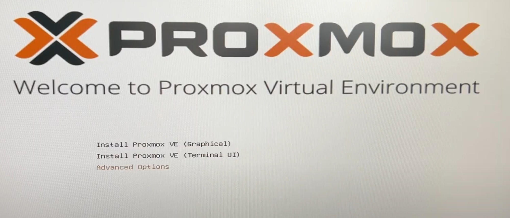
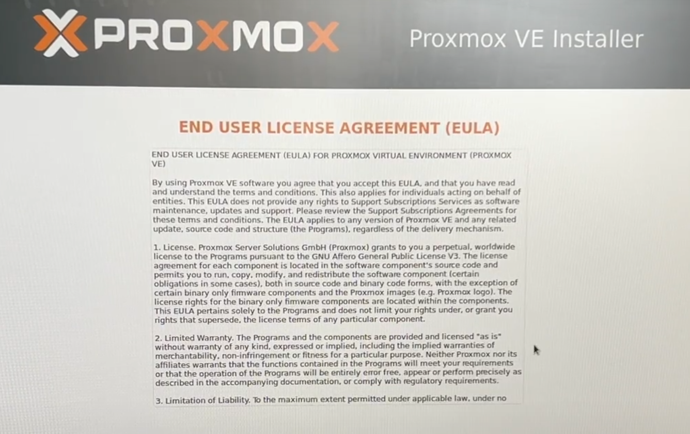
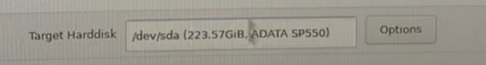
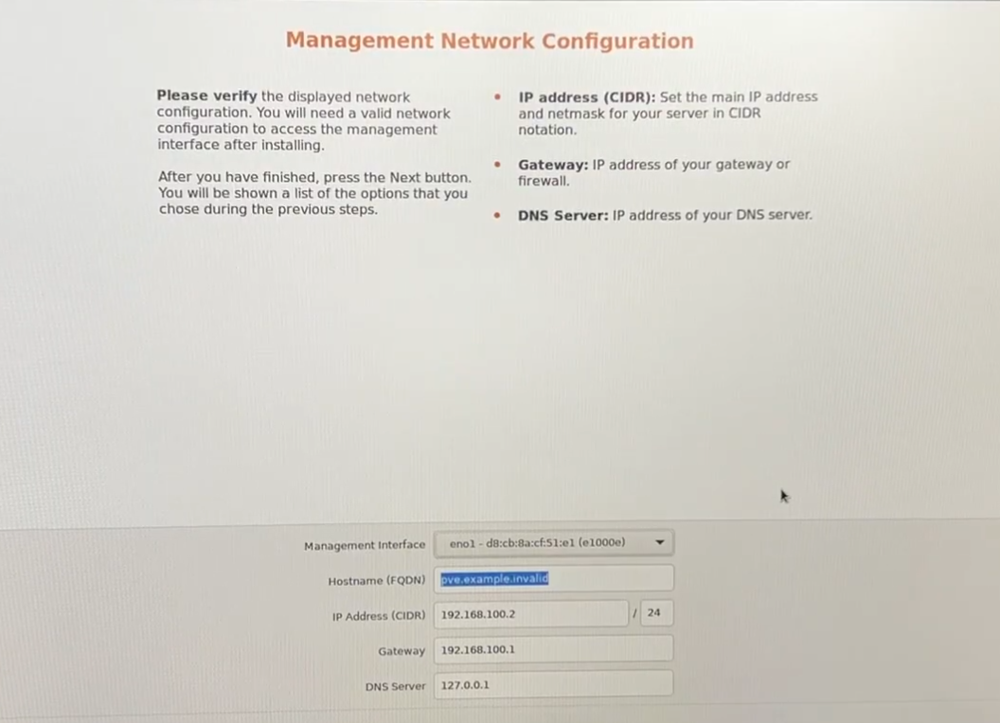

## Cześć!
<b>Krok 1 ISO </b> 
Dobra to zacznijmy przygotuj sobie pendrive tak z 8GB i wjedz na stronke https://www.proxmox.com/en/downloads i pobierz sobie wersję która cię interesuje.  
<b>Krok 2 Boot pendirve</b>  
Jak już masz to zrób sobie bootowalnego pena ja preferuje użyc rufusa ale jesli masz jakąś inna apke to okej. 
<b>Krok 3 Sprzęt</b>  
Podłącz pena do urządzenia na którym chcesz mieć proxmoxa. Wejdź do biosu używając kalwiszy(F2,Del,F10) i ustaw żeby bootwoało z pendrive na 1 miejscu  
<b>Krok 4 Instalacja</b>  
Jak już sie odpali to powinno się wam wyświetlic coś takiego polecam wybierzcie sobie to co chcecie na początek zalecam graphical 
 
Polecam zaakceptowac Eula
 
Następnie wybieracie dysk który wam odpowiada jak macie jeden pamiętajcie, że wszystkie dane z partycji utworzonej zostaną usunięte klikacie next
 
Następnie wyświetli sie location and time zone to polecam wpisac Poland w miejce Country ale tak to next  
Nasępny krok to ustawienie Hasła administratora polecam zrobić jakieś mocne hasło bo jest to ważne.  
Jesli chodzi o pole email polecam stworzyć nowy bo on bedzie po wysyłanie alertów typu że coś nie działa w systemie. 
Teraz się wyświetli konfiguracja sieciowa wybierzcie odpowieni interfejs który was interesuje 
Jeśli chodzi o Hostname nazwijcie go sobie jak checei ale polecam jakis srv-głowny.pve czy cos takiego 
Jeśli chodzi o address IP no to ustawiacie według własnego widzimise jak macie automatyczny dhcp to raczej powinno wam go przydzielic więc klikamy next 
 
No i wyświetla wam sie podsumowanie jeśli wszystko się zgadza to klikamy install 

